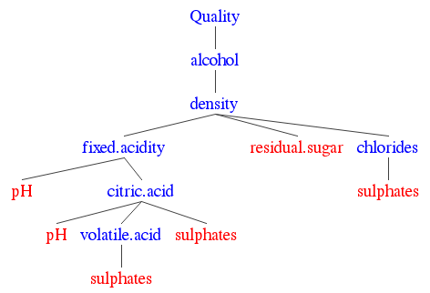

  
  
Red wine is one of the most beautiful drinks, so it's going to be interesting to find out what makes a good wine ! :)  
  
----
  
## <a name="contents"> Contents </a>

1. <a href="#data-set"> Data set </a>  
2. <a href="#exploring">Exploring data</a>  
3. <a href="#univarPlots">univariate plots</a>  
4. <a href="#quality">Analyzing quality</a>  
    &nbsp;&nbsp;&nbsp; 4.1 <a href="#quality_cor">Correlations with other variables</a>  
    &nbsp;&nbsp;&nbsp; 4.2 <a href="#quality_plots">bivariate plots with other variables</a>  
5. <a href="#influence">What chemical properties influence the quality</a>   
		&nbsp;&nbsp;&nbsp; 5.1 <a href="#influence_cor">Chemical properties correlation table</a>  
		&nbsp;&nbsp;&nbsp; 5.2 <a href="#influence_plots">Chemical properties bivariate plots</a>   
6. <a href="#lm">Building linear regression model</a>  
7. <a href="#summary">Final plots and summary</a>  
8. <a href="#reflection">Reflection</a>
9. <a href="#ref">Refrences</a>
10. <a href="#info">Author and contact informaion</a>


----

### <a name="data-set">Date set</a>

The data can be downloaded from this [link](https://www.google.com/url?q=https://s3.amazonaws.com/udacity-hosted-downloads/ud651/wineQualityReds.csv&sa=D&ust=1480517492986000&usg=AFQjCNH997PTSMOwZJcIcbrirMkj_G0A4w), also you can find it on my github along with other report resources :  [link](https://github.com/bekaa/Red-wine_quality_data_analysis) .

Also read this [text file](https://www.google.com/url?q=https://s3.amazonaws.com/udacity-hosted-downloads/ud651/wineQualityInfo.txt&sa=D&ust=1480517492987000&usg=AFQjCNGpnSwGV7Q2fH09opHGhc-P3Rr_mw) which describes the variables and how the data was collected.

The data-set contains 11 chemical characteristics beside a quality from 1 to 10 from at least 3 wine experts  for 1599 different wines!

-------
  
### <a name="exploring"> Exploring data </a>

```{r echo=FALSE,message=FALSE, warning=FALSE, packages}
library(ggplot2)
library(GGally)
library(gridExtra)
library(reshape2) #  melt()
library(memisc) # mtable()
```
  
```{r  message=FALSE, warning=FALSE}
wine <- read.csv('./data/wineQualityReds.csv')
```
  
The data has 1599 observations of 13 variables.
  
```{r warning=FALSE,message=FALSE}
str(wine)
```

> Input variables (based on physicochemical tests):  
   1.  fixed acidity (tartaric acid - g / dm^3)   
   2.  volatile acidity (acetic acid - g / dm^3)    
   3.  citric acid (g / dm^3)  
   4.  residual sugar (g / dm^3)  
   5.  chlorides (sodium chloride - (g / dm^3)    
   6.  free sulfur dioxide (mg / dm^3)  
   7.  total sulfur dioxide (mg / dm^3)  
   8.  density (g / cm^3)  
   9.  pH  
   10.  sulphates (potassium sulphate - g / dm3)  
   11.  alcohol (% by volume)  
   Output variable (based on sensory data):   
   12.  quality (score between 0 and 10)  
     
```{r warning=FALSE,message=FALSE,cache=TRUE,echo=FALSE,fig.height=10,fig.width=10}
ggpairs(subset(wine,select = -X),  axisLabels = 'show',
				lower = list(continuous = wrap("points", shape = I('.'))), 
				upper = list(combo = wrap("box", outlier.shape = I('.'))))
```


----

### <a name="univarPlots">univariate plots</a>  
  
A closer look on the one variable plots. 

* The red lines represents the 25% and 75% quantiles(ie. 25% of the data lies on left for the first line), and the blue one represents the 50% quantile.  
  
```{r echo=FALSE,warning=FALSE,message=FALSE}
source('./univariate_plots.R')
```


----

### <a name="quality">Analyzing quality</a>

```{r warning=FALSE,message=FALSE,cache=TRUE}
table(wine$quality)
```
> 82.5 % of wines either have quality of 5 or 6 .  

#### <a name="quality_cor">Correlations with other variables</a>
  
Let's zoom into the correlation between quality and the chemical characteristics :  
  
 variable | Pearson corr 
 ------- | -----
 fixed.acidity | 0.12  
 volatile.acidity | -0.39  
  citric.acid | 0.23  
  residual.sugar | 0.01  
  chlorides | -0.13  
  free.sulfur.dioxide | -0.05  
  total.sulfur.dioxide | -0.19  
  density | -0.17  
  pH | -0.06  
  sulphates | 0.25  
  alcohol | 0.48  
  
>  as we can see the only relatively good correlation is with the alcohol percentage. 

#### <a name="quality_plots">bivariate plots with other variables</a>

The below scatter plots between quality and each of the characteristics confirms the correlation values.


* the black line represents the mean . 
```{r echo=FALSE,warning=FALSE,message=FALSE}

for (X in names(wine)[-c(1,13)] )
{
	
	Xcolumn <- wine[, c(X)] 
	limits <- range( Xcolumn )
  breaks <- seq(limits[1],limits[2], ((limits[2]-limits[1])/10.0) )
	print(
		
	  ggplot(aes(  x = Xcolumn, y = quality ) ,
				 				data = wine)+
			xlab( X )+
			geom_point(fill = 'red', color = 'blue',
							 	shape = 21,position= 'jitter')+
			stat_summary(fun.y = mean, geom = 'line')+
			scale_x_continuous( limits = limits, breaks = breaks)+
			scale_y_continuous( limits = c(0,10),
												breaks = seq(0,10,1) )
	)
 } 
```

----

### <a name="influence">What chemical properties influence the quality</a>   

Now it's time to put our question : 

> which chemcical chracterestics influence the quality, or it there any relation between them !   
  
Logic says yes, but correlations and graphs says the opposite.    

Lets think in some different way, instead of searching for the direct relation between each characteristic and quality, let's find relations between chemical characteristics and each other.    

#### <a name="influence_cor">Chemicals' correlation table</a>    
		
The below correlation table is a good way to find these relations.

The correlations are computed using both Pearson and spearman algorithms, so each element in the table is structured as : &nbsp;&nbsp;&nbsp;&nbsp;Pearson's / spearman's .  

Correlations bigger than .3 or less than -.3 are colored in Red.  


--|fixed.acidity | volatile.acidity | citric.acid | residual.sugar | chlorides | free.sulfur.dioxide | total.sulfur.dioxide | density | pH | sulphates | alcohol  
-----|-----|-----|-----|-----|-----|-----|-----|-----|-----|-----|----- 
fixed.acidity | <span style="color:blue"> 1 </span>  |   |   |   |   |   |   |   |   |   |    
volatile.acidity | -0.26 <span style="color:DarkGreen"> / </span> -0.28 | <span style="color:blue"> 1 </span>  |   |   |   |   |   |   |   |   |    
citric.acid | <span style="color:red"> 0.67 </span> <span style="color:DarkGreen"> / </span> <span style="color:red"> 0.66 </span> | <span style="color:red"> -0.55 </span> <span style="color:DarkGreen"> / </span> <span style="color:red"> -0.61 </span> | <span style="color:blue"> 1 </span>  |   |   |   |   |   |   |   |    
residual.sugar | 0.11 <span style="color:DarkGreen"> / </span> 0.22 | 0 <span style="color:DarkGreen"> / </span> 0.03 | 0.14 <span style="color:DarkGreen"> / </span> 0.18 | <span style="color:blue"> 1 </span>  |   |   |   |   |   |   |    
chlorides | 0.09 <span style="color:DarkGreen"> / </span> 0.25 | 0.06 <span style="color:DarkGreen"> / </span> 0.16 | 0.2 <span style="color:DarkGreen"> / </span> 0.11 | 0.06 <span style="color:DarkGreen"> / </span> 0.21 | <span style="color:blue"> 1 </span>  |   |   |   |   |   |    
free.sulfur.dioxide | -0.15 <span style="color:DarkGreen"> / </span> -0.18 | -0.01 <span style="color:DarkGreen"> / </span> 0.02 | -0.06 <span style="color:DarkGreen"> / </span> -0.08 | 0.19 <span style="color:DarkGreen"> / </span> 0.07 | 0.01 <span style="color:DarkGreen"> / </span> 0 | <span style="color:blue"> 1 </span>  |   |   |   |   |    
total.sulfur.dioxide | -0.11 <span style="color:DarkGreen"> / </span> -0.09 | 0.08 <span style="color:DarkGreen"> / </span> 0.09 | 0.04 <span style="color:DarkGreen"> / </span> 0.01 | 0.2 <span style="color:DarkGreen"> / </span> 0.15 | 0.05 <span style="color:DarkGreen"> / </span> 0.13 | <span style="color:red"> 0.67 </span> <span style="color:DarkGreen"> / </span> <span style="color:red"> 0.79 </span> | <span style="color:blue"> 1 </span>  |   |   |   |    
density | <span style="color:red"> 0.67 </span> <span style="color:DarkGreen"> / </span> <span style="color:red"> 0.62 </span> | 0.02 <span style="color:DarkGreen"> / </span> 0.03 | <span style="color:red"> 0.36 </span> <span style="color:DarkGreen"> / </span> <span style="color:red"> 0.35 </span> | <span style="color:red"> 0.36 </span> <span style="color:DarkGreen"> / </span> <span style="color:red"> 0.42 </span> | 0.2 <span style="color:DarkGreen"> / </span> <span style="color:red"> 0.41 </span> | -0.02 <span style="color:DarkGreen"> / </span> -0.04 | 0.07 <span style="color:DarkGreen"> / </span> 0.13 | <span style="color:blue"> 1 </span>  |   |   |    
pH | <span style="color:red"> -0.68 </span> <span style="color:DarkGreen"> / </span> <span style="color:red"> -0.71 </span> | 0.23 <span style="color:DarkGreen"> / </span> 0.23 | <span style="color:red"> -0.54 </span> <span style="color:DarkGreen"> / </span> <span style="color:red"> -0.55 </span> | -0.09 <span style="color:DarkGreen"> / </span> -0.09 | -0.27 <span style="color:DarkGreen"> / </span> -0.23 | 0.07 <span style="color:DarkGreen"> / </span> 0.12 | -0.07 <span style="color:DarkGreen"> / </span> -0.01 | <span style="color:red"> -0.34 </span> <span style="color:DarkGreen"> / </span> <span style="color:red"> -0.31 </span> | <span style="color:blue"> 1 </span>  |   |    
sulphates | 0.18 <span style="color:DarkGreen"> / </span> 0.21 | -0.26 <span style="color:DarkGreen"> / </span> <span style="color:red"> -0.33 </span> | <span style="color:red"> 0.31 </span> <span style="color:DarkGreen"> / </span> <span style="color:red"> 0.33 </span> | 0.01 <span style="color:DarkGreen"> / </span> 0.04 | <span style="color:red"> 0.37 </span> <span style="color:DarkGreen"> / </span> 0.02 | 0.05 <span style="color:DarkGreen"> / </span> 0.05 | 0.04 <span style="color:DarkGreen"> / </span> 0 | 0.15 <span style="color:DarkGreen"> / </span> 0.16 | -0.2 <span style="color:DarkGreen"> / </span> -0.08 | <span style="color:blue"> 1 </span>  |    
alcohol | -0.06 <span style="color:DarkGreen"> / </span> -0.07 | -0.2 <span style="color:DarkGreen"> / </span> -0.22 | 0.11 <span style="color:DarkGreen"> / </span> 0.1 | 0.04 <span style="color:DarkGreen"> / </span> 0.12 | -0.22 <span style="color:DarkGreen"> / </span> -0.28 | -0.07 <span style="color:DarkGreen"> / </span> -0.08 | -0.21 <span style="color:DarkGreen"> / </span> -0.26 | <span style="color:red"> -0.5 </span> <span style="color:DarkGreen"> / </span> <span style="color:red"> -0.46 </span> | 0.21 <span style="color:DarkGreen"> / </span> 0.18 | 0.09 <span style="color:DarkGreen"> / </span> 0.21 | <span style="color:blue"> 1 </span>   


----------------

#### from the above table we can conclude the following :

> <span style="color:red">fixed acidity</span>  is correlated to  citric acid, density and pH.  
> <span style="color:red">volatile acidity</span>  is correlated to  citric acid and sulphates.  
> <span style="color:red">citric acid</span>  is correlated to  volatile, fixed acidity, pH and sulphates.  
> <span style="color:red">chlorides</span> is correlated to density and sulphates.  
> <span style="color:red">density</span> is correlated to fixed acidity, alcohol, residual sugar and chlorides.  
> <span style="color:red">pH</span> is correlated to fixed acidity and citric acid.  
> <span style="color:red">sulphates</span> is correlated to volatile acidity, citric acid and chlorides.  
> <span style="color:red">residual sugar</span> is correlated to density.  
> <span style="color:red">alcohol</span> is correlated to density.  

-----

#### And from that we get this tree :    
  
  
    
     
So we have 7 parent nodes which has children :   
&nbsp; Quality, Alcohol, Density, Fixed Acidity, Chlorides, Citric acid and Volatile acidity.   
  
And all of them depend on each other, so as we know alcohol affects quality, alcohol is affected by density which is affected by other chemicals which is affected.... and so on.  
  
With counting negative and positive correlations, quality value increases when the following happen :
    
       
 volatile acidity		 pH		 Sulphates	 

 Citric acid		 pH		 Sulphates  

 Fixed acidity		 Residual sugar		 Chlorides   

 Density  

 Alcohol  

 Quality  
   
----------

Lets go back to our question, <span style="color:DarkBlue">WHAT CHEMICAL PROPERTIES INFLUENCE THE QUALITY</span>.  
  
To answer that we must go through the earlier tree from the bottom to the top.  
  
#### <a name="influence_plots">Chemical properties bivariate plots</a>
  
The below plots explain that, the fist plot has the Quality as Y(dependent), then the next variable in the tree will be the Y of the next plot and so on .  
  
* the black line represents the line of best fit (linear model).
* the purple line represents the mean.
* the two blue lines represents the first and third quantile.
* and the black points are the data .
* density is multiplied to 1000 to convert it to the same unit as the other variables(gm/dm^3). 
  
```{r, echo=FALSE, message=FALSE, warning=FALSE}
source('./Chemical_properties_bivariate_plots.R')

```

-----

### <a name="lm"> Building linear regression model </a>

After we proved the relation between quality and chemical properties, lets build  a regression model so in future if we have chemical properties for some wine, we can predict it's quality.  
  
> Simple linear regression uses an independent variable to predict the outcome of a dependent variable.     
  
we will use the formula Y ~ X , where X represents the relations represented above in the tree.  
Because the variables are from different scales, so it would be nicer if all of them are scaled to the same scale.
I'll choose the scale from 0 to 10 , so every element in each variable will have a value from 0 to 10 keeping the statistics not changed.  
A new variable is set for the new data called  'wine.ratio'.  
  
```{r, message=FALSE, warning=FALSE, echo=FALSE}
source("./maintaing_ratio.R")
```  
  
Now lets look at the model :  
  
```{r, message=FALSE,warning=FALSE}


reg_lm <- lm( quality ~
								
								alcohol * density +   
							 	density * fixed.acidity +  
							 	density * residual.sugar +  
							 	density * chlorides +  
							 	chlorides * sulphates +   
							 	fixed.acidity * pH +  
							 	fixed.acidity * citric.acid +  
							 	citric.acid * pH +  
							 	citric.acid * volatile.acidity +  
 							 	citric.acid * sulphates+  
							 	volatile.acidity * sulphates  
							
										 
							,data = wine.ratio )  

# print some information about the model
mtable( reg_lm, sdigits = 3 )

```
  
* Quality can be explained with this model by 36% (R-squared Value).
* 95 % of the predicted interval should fall within +/- 129.8% of the fitted line.  
   
---------
  
### <a name="summary"> Final plots and summary </a>    

I choose three plots to summary the analysis we did :
 
The first one is visualization of the regression model.  
I'll graph box plots for the formula Y ~ X, where Y (wine Quality) as a factor on the x-axis, and X is as shown above the relations between chemical properties and each other on the y-axis.  
I'll use the new data-set here wine.ratio.   
   
```{r, message=FALSE,warning=FALSE,echo=FALSE}

ggplot( aes( y = alcohol * density +
						 	density * fixed.acidity +  
						 	density * residual.sugar +  
						 	density * chlorides +  
						 	chlorides * sulphates +   
						 	fixed.acidity * pH +  
						 	fixed.acidity * citric.acid +  
						 	citric.acid * pH +  
						 	citric.acid * volatile.acidity +  
 						 	citric.acid * sulphates+  
						 	volatile.acidity * sulphates
						 
						  ,x = factor(quality) ), data = wine)+
	
	geom_boxplot()+
	labs(title = 'Y ~ X of the linear regression model',
			 subtitle = 'formula is shown in the linear regression section above')+
	xlab('Wine quality')+
	ylab('X of the regression formula')
```
 
As shown above the mean of X is getting higher as quality get higher for the quality ( 3,5,6,7), an exception for 4 and 8, the mean of X at quality 4 is lower than the mean at 3, and the mean at quality 8 is lower the mean at quality 7.  
But still we can say the as quality increases the X increases.  
 
---
  
The second one will show the difference  between the actual quality, and the quality predicted by the regression model.
Lets start first make a new column in the data called "quality.predicted", it will hold the predicted data using the regression model. 
  
```{r, message=FALSE,warning=FALSE}
wine$quality.predicted <- round( predict(reg_lm, wine.ratio ) )
```
  
Now lets plot it :   
  
```{r, message=FALSE,warning=FALSE,echo=FALSE}
# convert the two columns "quality and quality.predicted" to long format to plot them.
quality.long <- melt(subset(wine,select =   c(quality,quality.predicted)),
										 variable.name =  'type',
										 value.name = 'quality')

ggplot(quality.long,aes(x= quality, fill=type))+
	geom_histogram( position="dodge",binwidth = .5 )+
	xlab("Quality")+ylab("Count")+
	ggtitle('actual quality vs predicted quality')+
	scale_x_continuous( limits = c(0,10) ,breaks = seq(0,10,1))+
  scale_y_continuous( limits = c(0,800) ,breaks = seq(0,800,100))

rm(quality.long)  #no longer need to keep it.
```
  
The  bars shows the number of wines having a quality x.  
The red ones for the actual quality, and the blue are for the predicted quality.  
Most of the predicted quality are 5 and 6, and a little of 7. 
The model couldn't predict the quality of 3,4 and 8.  
Instead it predicted 5 and 6 more than the actual one.  
   
---- 
    
The last one shows the density of each chemical property over each quality level from 3 to 8 .
  
```{r message=FALSE,warning=FALSE,echo=FALSE}

# convert all the data to long format to plot it easily.
wine.ratio.long <- melt(subset(wine.ratio
															 ,select = -c(X,free.sulfur.dioxide,
															 						 total.sulfur.dioxide)),
										 variable.name =  'type',
										 value.name = 'value',
										 id.vars = c('quality'))

ggplot( aes( x = value, fill = type), data = subset(wine.ratio.long))+
	geom_density()+
	scale_x_continuous( limits = c(0,10),
										breaks = seq(0,10,.5) )+
	facet_grid(factor(quality) ~. )+
	xlab(' ratio value ')+
	labs(title = ' Density of chemical properties over quality level ',
			 subtitle = 'Quality levels start from 3 to 8')

rm(wine.ratio.long) #no further need to it.
```
  
Sulphates has low values in quality levels 3, 4, 5 and 6, and a little bit higher in 7 and 8.  
Chlorides most values at quality level 8 are of value 1 , and as quality level goes lower the number of rows having value 1 reduces.   
Residual sugar has low values for all quality levels.  
Fixed acidity for low quality levels 3,4 and 5, have most of it's values under 3, but in quality levels 6, 7 and 8 it's values are spread out.  
Other chemicals are spread on the graph for all quality levels.

-----

#### Summary
 
We started by wondering about the relation between the quality of wine and it's chemical properties, it's clear that there must be a relation, although we proved some week relation but it still week and  we can't count on it .  
  
So how does this make sense !, If we trusted that the chemical test were true and there is no error in the data, so there is error in the human factor !, lets not to forget that the quality is entered by humans and humans always make mistakes!.
  
So I believe to some degree that many values of the quality are entered from person favorite not because it's actually high quality.

-----  
  
### <a name="#reflection"> Reflection </a>  

So how we really get that relation between wine's quality and it's chemical properties ?.  
  
I don't believe that diving deeper in this data set would give me the answer.
So to get the answer we have to find the best data set for it, maybe that data would contain prices, brands, and more accurate quality or drinkers' review.
  
Also chemical properties aren't everything that matters in wine, there still the type of the grape used, the quality of wine brand, any flavors added and other things that haven't been considered in the data-set.
  
Another thing, the fact the most of the quality values are 5 or 6 makes it harder to analysis the data, there are no very good wines ( of quality 9 or 10), or very bad wines ( of quality 0, 1 or 2), which confirms also that the data aren't strong enough to use it and as I said humans make mistakes.
  
------- 
  
### <a name="ref"> Refrences </a>

The data-set used in this report :  
  
P. Cortez, A. Cerdeira, F. Almeida, T. Matos and J. Reis. 
  Modeling wine preferences by data mining from physicochemical properties.  
  In Decision Support Systems, Elsevier, 47(4):547-553. ISSN: 0167-9236.  
   
Available at:   
[Elsevier](http://dx.doi.org/10.1016/j.dss.2009.05.016)  
[Pre-press (pdf)](http://www3.dsi.uminho.pt/pcortez/winequality09.pdf)  
[bib](http://www3.dsi.uminho.pt/pcortez/dss09.bib)   
    
---
  
### <a name="info">Author and contact information</a>  
    
This analysis is done by a udacity's Data-analysis Nano-degree program Student as a course project.     
    
__Github:__ https://github.com/bekaa   
__LinkedIn:__ https://eg.linkedin.com/in/khaled-salah-48360590   
__WordPress:__: https://khaledsalahblog.wordpress.com   
__Email:__ sci.kd.eg@gmail.com   
 
----
   


